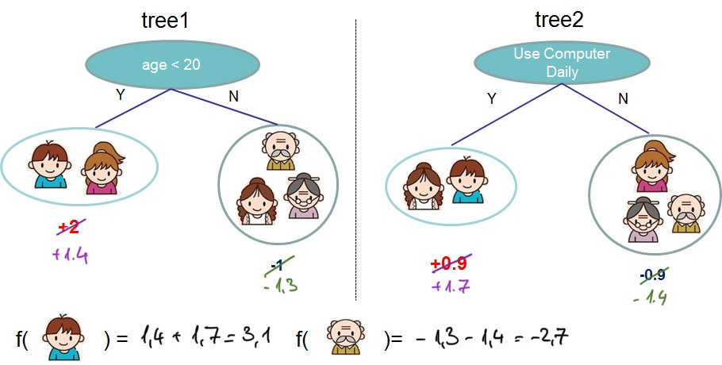

#  How it works

`transferboost` applies the idea of
[Transfer Learning](https://en.wikipedia.org/wiki/Transfer_learning) to 
gradient boosting models. 
Transfer learning focuses on "storing knowledge gained while solving one problem and applying 
it to a different but related problem" (cit Wikipedia). 
Within the context of gradient boosted trees, the knowledge of one task is encoded 
the tree structure that was learned during the training process. 

## Example

The cartoon depicted in the [XGboost documentation](https://xgboost.readthedocs.io/en/latest/tutorials/model.html)
and in the [XGBoost Paper](https://arxiv.org/pdf/1603.02754.pdf) is a good example to illustrate how 
`transferboost` works.

#### Starting task
Consider this being a shallow, two-tree-xgboost model, trained to predict if a person likes video games.
The first tree splits the population in two groups, based on age, while the second splits the population 
based on the daily usage of a computer.

#### Transfer learning process
Consider the use case where you want to switch use case, from predicting if a person likes video games to 
if the person watches netflix. 
The tree structure learned in the previous task might not be the optimal, but it might still have 
predictive power to predict the new task. 
When performing the transfer learning, `transferboost` assigns new values of every leaf by keeping the learned 
tree structures and re-calculates the leaf values by using the new targets, as shown in the image 

## More in detail 

In order to recalculate tle leaf values,
`transferboost` leverages on the equation used by XGBoost and Lightgbm to calculate the optimal leaf values, ie.

$$
w_{j} = \frac{\sum_{i \in I_{j}} g_{i}}{\sum_{i \in I_{j}} h_{i} + \lambda}
$$

where `j` represents the index of the leaf, `I_{j}` represents all the entries ending up in the j-th leaf.
`g` and `h` represent the gradient and hessian of the loss function.  

The following steps are performed in order to recalculate the leaf values:  
- `transferboost` remaps the data to the leaf by applying the trained 
xgboost or lightgbm model, in order to obtain `I_{j}`. 
- the gradient `g` and hessian `h` are computed using the new target `y2`
- once the gradients and hessians are calculated, the leaf outputs follow as per the equation above.

